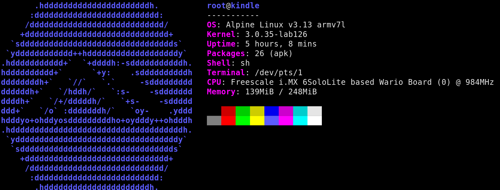

# alpine-kindle-chroot-builder
A script for generating an Alpine Linux chroot environment compatible with Amazon Kindle devices. 



## Purpose
The Amazon Kindle family of devices use a minimal, constrained Linux environment that lacks many of the features found within more complete distributions. This repository allows you to use software which would otherwise be unavailable without needing to make significant modifications to the root filesystem of your Kindle device.

## Usage
__Note: In most cases, you probably won't need to create a chroot environment from scratch and should use one of the pre-generated releases [available on the Releases page](https://github.com/katadelos/alpine-kindle-chroot-builder/releases) instead.__
### Building a chroot package
- To build a chroot package, run the `build-alpine-chroot.sh` script as root:
```
sudo ./build-alpine-chroot.sh
```
### Unpacking a chroot package
- To unpack a chroot package, run the following commands on the Kindle:
```
cd /mnt/us
tar -xzf alpine-chroot.tar.gz
```
### Entering the chroot environment
- The chroot environment needs to be set up before each use. To do this, run the following commands on the Kindle:
```
cd /mnt/us/alpine-chroot
./launch-chroot.sh start
```
- To enter the chroot environment, run the following command:
```
./launch-chroot.sh enter
```

## Credits
This script is based upon [alpine-kindle](https://github.com/schuhumi/alpine_kindle) script created by [schuhumi](https://github.com/schuhumi/alpine_kindle), who has made it possible to run a full GUI environment within an Alpine chroot!

## License
alpine-kindle-chroot-builder is released under the GPL-3.0 License. See LICENSE for details.